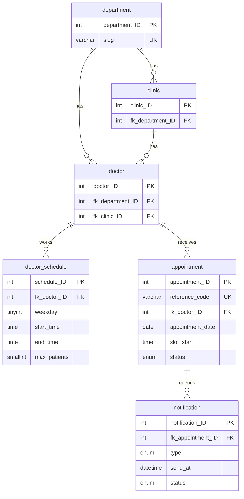

# Trooper

<!-- After pushing, add your CI badge:  -->

Trooper is a chatbot that books, reminds, and cancels hospital appointments automatically. Patients chat in English or Filipino. A MySQL database holds the doctors, schedules, and bookings, and a background job sends the messages.

It started as MedSched, a proposed scheduling system for the Veterans Memorial Medical Center (VMMC), and was rebuilt around a database. The VMMC details in the demo are public information used as an example hospital. All patient and doctor names in the sample data are fictional.

<!--
## Screenshots

| Chatbot | Booking confirmed |
| --- | --- |
|  |  |

| Staff dashboard | Manage and cancel |
| --- | --- |
|  |  |
-->

## What it automates

| Task | How Trooper handles it |
| --- | --- |
| Finding open times | Slots are generated from each doctor's schedule. Nothing is typed in by staff. |
| Double booking | Each booking runs in one transaction that locks the doctor row, so the last slot can only be taken once. |
| Choosing a doctor | First time patients get the earliest open times across the whole clinic. |
| Confirmation | A reference code and a confirmation text are created the moment a booking is saved. |
| Reminders | A reminder is queued for 24 hours before the visit. A job sends it and retries failures up to 3 times. |
| Changes | Patients check or cancel with their reference code and mobile number. The slot is released and queued messages are dropped. |
| Staff view | A dashboard shows today's queue, doctor workload, and the message log. |

## Run it locally

You need Node.js 18 or newer and a running MySQL server (MariaDB 10.5 or newer also works).

1. Install packages: `npm install`
2. Copy `.env.example` to `.env`. Fill in your MySQL password, an `ADMIN_TOKEN`, and keep `TZ=Asia/Manila` (or use your hospital's time zone).
3. Build the database with sample data: `npm run db:seed` (this resets the tables). Use `npm run db:init` for empty tables.
4. Start the app: `npm start`, then open http://localhost:3000
5. Staff dashboard: http://localhost:3000/admin.html, signed in with your `ADMIN_TOKEN`

Texts are printed in the server log by default. To send real SMS, replace `send()` in `services/sms.js` with a call to your SMS provider. Nothing else changes.

## Run with Docker

```bash
docker compose up --build
```

Open http://localhost:3000. The staff dashboard is at `/admin.html` with the token `demo_token`. The first start builds the database and loads sample data. See [docs/DEPLOYMENT.md](docs/DEPLOYMENT.md) for hosting steps and [docs/ARCHITECTURE.md](docs/ARCHITECTURE.md) for how it works.

## Why MySQL

The first version saved appointments to a Firebase Realtime Database straight from the browser, while the doctor list lived in a second copy inside the JavaScript. Booking is relational and rule based, so Trooper now uses MySQL:

* Foreign keys and unique keys keep doctors, schedules, and bookings consistent
* Transactions make "check the slot, then book it" one safe step
* Joins and grouping power the staff dashboard
* The browser never touches the database. It only calls the API, so the credentials stay on the server

## Database



How capacity works: a doctor's `max_patients` is the daily limit. A day is split into slots (60 minutes by default), and each slot holds `ceil(max_patients / slots)` patients. Trooper enforces both the slot limit and the daily limit.

## How the automation loop works

1. Booking or cancelling inserts rows into `notification` with a `send_at` time and the status `queued`.
2. `services/notifier.js` wakes up every 30 seconds, finds rows that are due, sends them, and marks them `sent`.
3. A failed send stays `queued` and is retried. After 3 attempts it becomes `failed`.
4. Cancelling marks any unsent messages as `skipped`.

## API

| Method and path | Purpose |
| --- | --- |
| `GET /api/config` | Hospital details, departments, and clinics (the chatbot builds its menus from this) |
| `GET /api/doctors?department=&clinic=` | Doctors and working days |
| `GET /api/doctors/:id/availability` | Open slots over the booking window |
| `GET /api/availability/next?department=&clinic=` | Earliest open times across a clinic |
| `POST /api/appointments` | Book a slot |
| `GET /api/appointments/:ref?phone=` | Look up a booking |
| `POST /api/appointments/:ref/cancel` | Cancel a booking |
| `GET /api/admin/summary` | Staff dashboard data (needs the `x-admin-token` header) |
| `POST /api/admin/run-notifier` | Run the automation job now (staff only) |

## Project structure

```
server.js              Express app and /health check
config/                env and time zone, database pool, hospital details
routes/                public API and staff API
services/              scheduling rules, notifier job, SMS, messages, time helpers
middleware/limit.js    small rate limiter
db/                    schema.sql, seed.sql, queries.sql
scripts/init-db.js     builds the database (db:init, db:seed, db:ensure)
test/api.test.js       21 tests, including 10 people booking one slot at once
public/                chatbot page, staff dashboard, styles, scripts
docs/                  architecture, deployment, screenshots
Dockerfile             container image
docker-compose.yml     app plus MySQL in one command
.github/workflows/     CI: tests on Node 20 and 22, and a Docker build check
```

## Tests

The GitHub Actions workflow runs these tests on every push and checks that the Docker image builds. `npm test` builds a separate `trooper_test` database and checks the catalog, availability, booking rules, daily and slot limits, simultaneous bookings, cancelling, the notifier and its retries, the staff API, and the rate limiter.

## Security notes

* All database queries use placeholders, so SQL injection is blocked
* Text from patients is shown with `textContent`, so it can never run as HTML
* Reference codes need the matching mobile number, and wrong guesses look the same as "not found"
* The staff token is compared in constant time, and the dashboard is off when `ADMIN_TOKEN` is empty
* The rate limiter is in memory and the notifier runs in one process. For real hosting, use a shared store and run the job in one place

## Known limits

* Appointments hold a patient name and phone number. Use fake data in a demo, and add consent, retention, and access controls before using real patient data
* The service photos in `public/assets/images` and the bot avatar are from the original project. Check you have the right to use them before publishing
* No staff login beyond a shared token, no rescheduling (cancel and rebook), and no patient records yet

## Roadmap

* Rescheduling in one step
* Individual staff accounts instead of one token
* A real SMS provider
* Waitlist that fills a cancelled slot automatically

## Team

Add the names of your group members and each person's part here.
