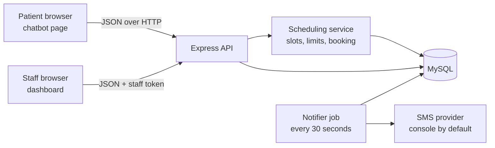
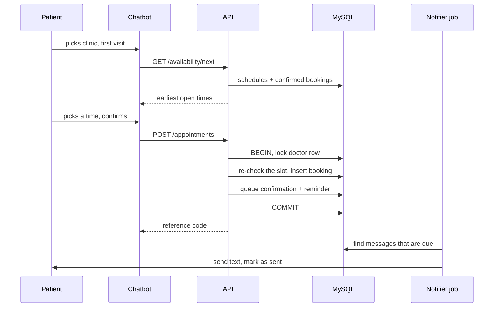

# Architecture

## Overview

The browser never talks to the database. The chatbot builds its menus from `GET /api/config`, so departments, clinics, doctors, and times always match the database.

## A booking, step by step

## Design decisions

| Decision | Reason |
| --- | --- |
| Slots are generated, not stored | Changing a doctor's schedule changes availability at once. No slot rows to keep in sync. |
| Booking locks the doctor row | Bookings for one doctor happen one at a time, so two people can never take the last place. Tested with 10 simultaneous requests. |
| Slot limit and daily limit | A slot holds `ceil(max_patients / slots)`, and the doctor never exceeds `max_patients` per day. |
| Notifications are a database queue | Booking and cancelling only insert rows. A separate job sends them, retries failures, and skips unsent ones after a cancel. |
| Cancelling needs reference code and phone | Wrong guesses look the same as "not found", so codes cannot be probed. |
| Dates and times are plain text | `YYYY-MM-DD` and `HH:MM` avoid time zone bugs between the browser, server, and database. |
| Hospital details live in `config/hospital.js` | Another hospital can use Trooper by changing one file and the seed data. |

## Limits to know about

* The rate limiter is in memory, and the notifier runs inside the web process. Run one instance, or move both to shared services before scaling.
* There is one shared staff token, not individual staff accounts.
* Patients can cancel but not reschedule. They cancel and rebook.
